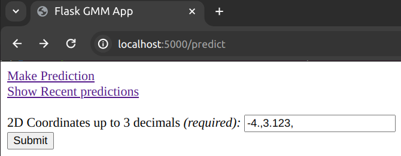
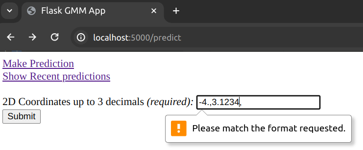
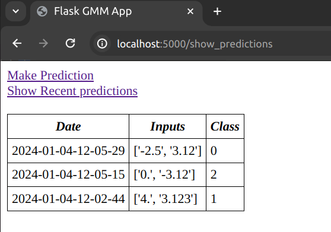

# Flask app for Gaussian Mixture Model classification:

## Endpoints:
### The `/predict` endpoint:
The `/predict` endpoint gives a form to be filled. The form is validated on the client side by requiring a regex match. It requires two comma-separated floats (and a trailing comma) up to 3 decimal places precision. This is because in the demo, the GMM works with 2d inputs.
```html
<input type="text" name="coords" id="coords" value="-4.,3.123," required pattern="^(-?[0-9]\.([0-9]){0,3},){2}$"/>
```

Once the submit button is clicked, or alternatively `curl` is executed with appropriate flags:
```bash
curl -X POST -F coords=-4.,3.123, localhost:5000/predict
```
a json is returned of the type:
```
{
  "2024-01-08-08-55-54": "0"
}
```
denoting when the form data was read and `"0"` stands for the index of the group in which the inputs were classified by the model. So the json is `{"date": "predicted_class"}`.

#### Predict from the Browser:
From the browser, the form looks like this:



Example of client side validation because a 4-decimal float was entered when we only support up to 3 decimal places:



### The `/show_predictions` endpoint:
The `/show_predictions` endpoint gives a table of recent predictions together with their inputs in reverse chronological order. An example table is shown below:



If no POST requests have been made yet, an empty table will be displayed.

The records in the table are managed by the `RecencyStore` class in `flask_gmm/utils.py`. It takes an `int` as its `max_len` parameter in its constructor and once `max_len` is reached, whenever a new record is added, the oldest one is evicted.

The links to the `/predict` and `/show_predictions` endpoints are given as a navigation list on each page.

### Running in flask debug mode:
To run a demo on a flask dev server, I suggest you go to the `probabilistic_models` root directory and build the docker image from the `Dockerfile-gmm` using:
```bash
DOCKER_BUILDKIT=1 docker build -t mixture-models-flask -f Dockerfile-gmm .
```

and then again from that directory run the container in interactive mode overriding the CMD with `bash` like so:
```
docker run -v $PWD:/model/probabilistic_models -it -p 5000:5000 --name flask-cont mixture-models-flask bash
```

This will start a terminal emulator inside the container. Then to save a trained GMM model you should run the fit-predict test like so:
```
python3 -m pytest tests/test_gmm_server.py::test_fit_predict
```
from inside the container terminal emulator.

Finally, to start the flask development server you should run the command:
```
flask --app flask_gmm/app.py --debug run --host 0.0.0.0
```

Now you should be able to see the `/predict` webpage if you type `localhost:5000/predict` in your web browser.
